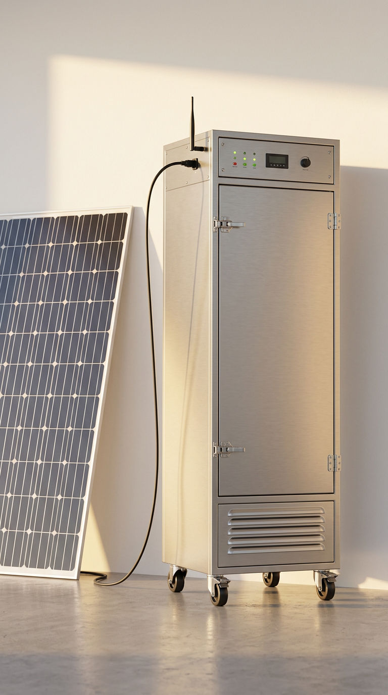

# 🌿 SMART DEHUMIDIFIER PILLAR — Full Documentation

**A 6-ft solar drying pillar for agarbattis (incense sticks): one 550 W
panel in, 500 W of heat out, zero fuel, zero internet.** Load the trays,
press Start, walk away — it holds the temperature, vents the humidity,
weighs the batch, protects itself, and remembers every cycle.

<p>

</p>

*Firmware v2.0 · single-file Arduino sketch · zero external libraries ·
two MCU variants (classic ESP32 + ESP32-S3) · OTA updates from the
dryer's own website.*

**Contents:** [1 Concept](#1-concept) · [2 Specifications](#2-specifications-at-a-glance) ·
[3 Batch workflow](#3-how-a-batch-runs) · [4 Features](#4-feature-list-firmware-v18) ·
[5 Wiring & pins](#5-wiring--pin-maps) · [6 Parameters](#6-every-parameter) ·
[7 Safety](#7-safety-chain) · [8 Error detection](#8-hardware-error-detection) ·
[9 Build](#9-build-it) · [10 Flash & update](#10-flash--update) ·
[11 Operate](#11-operate-it) · [12 Troubleshooting](#12-troubleshooting) ·
[13 Repo map](#13-repository-map) · [14 Roadmap](#14-roadmap) · [15 License](#15-license)

---

## 1. Concept

Rural incense workshops have sun but no internet, no grid reliability, and
no instrumentation. The pillar is a closed vertical chamber on a 12 V solar
loop: a 550 W panel charges a LiFePO4 battery through an MPPT controller;
a 500 W nichrome coil (driven by a BTS7960 bridge) holds the chamber at a
PID-controlled temperature; an outlet fan bursts air exchange by humidity;
an AHT10 + a DHT22 watch the chamber (S3; classic: 2 × AHT10) and a DHT11
watches the outdoors. An ESP32 runs everything, serves a full
website over its own WiFi hotspot (no app, no internet — the dryer IS the
network), and logs every second of every batch.

**Design rules that never bend:** library-free firmware · every feature
works offline (internet only via the owner's phone, when it has data) ·
the safety chain sits above every feature · pins frozen to the built board.

## 2. Specifications at a glance

| | |
|---|---|
| Power | 550 W solar panel → MPPT → 12.8 V LiFePO4 50–100 Ah (≥50 A BMS) |
| Heater | **500 W**: 0.32 Ω nichrome (2 × 1.15 m of 1.0 mm in parallel), BTS7960 43 A (heatsink), 1 kHz PWM, 50 A fuse |
| Chamber | 6 ft (1830 mm) standard / 8 ft option, 30 × 30 cm interior, insulated, 6–9 trays |
| Temperature | **default 60 °C (agarbatti)** · parameter ceiling 80 °C · hard cut 95 °C · chamber rated 100 °C |
| Modes | **AGARBATTI 60 °C · USER DEFINED · SILICAGEL 80 °C** (all 120 min) — C key, BUTTON-2 or the website |
| Control | door-gated workflow → full-power heat-up → PID (Kp/Ki/Kd) → **RH-triggered 1-min outlet-fan bursts** → target-weight tracking → purge → power off |
| Sensors | AHT10 top + DHT22 cool-return (S3; classic: 2 × AHT10) + DHT11 outdoor, HX711 weigh scale (2 × 5 kg), battery divider, door limit switch, supply optocoupler |
| Interface | **phone hotspot website — page 1 `/` full control, page 2 `/display` acts as the hardware display** (kiosk, read-only, 1 Hz) · 4×4 hex keypad · BUTTON-1 power (3 s off / 10 s reset) · BUTTON-2 default automation · solar toggle · USB serial console |
| Records | per-cycle CSV in flash (40 cycles) + graph, `wt_g` weight column, clock persisted across power-downs |
| Running cost | sunlight |

## 3. How a batch runs

```
POWER-ON ──► 🔒 START LOCKED ──► calibrate scale (known weight) ──► 🔓 GATE OPEN
              (once ever —          website or serial `cal 1000`        │
               stays calibrated)                                        ▼
                                                  LOAD TRAYS ──► CLOSE DOOR
                                                                        │  batch weighed
                                                                        ▼ (diff vs tare)
                                              ⚖ READY: 1234 g ──► START (site/keypad/button)
                                                                        │
                                     heat-up at FULL 500 W ──► PID holds setTemp
                                     fans follow humidity ──► weight settles?
                                                                        │
                                              time up + gates pass ──► PURGE (fans 100 %)
                                                                        ▼
                                              DONE ──► 🔓 unlock, unload, CSV saved
```

- Start is **refused everywhere** (website 403, keypad, BOOT button,
  serial) until the scale has been calibrated once — the door stays locked.
- Door opened mid-cycle = **instant FAULT** (heat off, purge, power off).
- Completion gates (all must pass): time elapsed · optional RH ≤ target ·
  optional weight-rate settled (dry-to-weight).

## 4. Feature list (firmware v2.0)

- **Boot:** all outputs LOW → **10 s initialisation window** with the
  ARCHITECTS OF SOLUTIONS / SMART DEHUMIDIFIER splash, power-on beeps and the
  full self-test — nothing energises before you've seen it.
- **Modes:** AGARBATTI (60 °C) / USER DEFINED / SILICAGEL (80 °C) — C key,
  BUTTON-2, website or serial `mode`.
- **Control:** full-power heat-up (MAX badge), PID hold, **RH-triggered
  outlet-fan bursts (RH ≥ 60 % for 1 min → 100 % for 60 s)**, purge,
  per-cycle history + CSV download, 18 h RAM curve (S3).
- **Power:** solar ⇄ bypass supply selection with a 2-channel relay +
  optocoupler live-check (S3), refused + error beep under load; BUTTON-1
  3 s = **hard power-off** (P-MOSFET latch), 10 s = reboot.
- **Website (hotspot 192.168.4.1, works with zero internet):** dashboard
  with gauges + 6-series graph, manual heat knob (60 s override,
  auto-release), one-page Parameters with **one-click factory defaults**,
  weight tile (Tare/Calibrate), door-state pill, 5-day typical forecast
  (date-derived), restyleable background (6 presets + custom + hairlines),
  OTA firmware upload page, online-UI bridge (optional GitHub Pages).
- **Display = the website (no hardware screen in this build):** `/` is
  the full-control dashboard; **`/display` is a read-only kiosk page**
  that behaves exactly like the hardware display — state, times, temps,
  RH, outdoor, battery, heat/fan bars, weight + target + diff, door,
  supply, faults in huge type, 1 Hz refresh, screen wake-lock — mount a
  phone/tablet on the pillar as the screen. Keypad still works (menu
  echoes on serial), BOOT-button start/stop (S3), BUTTON-2 default
  automation. Beep language: 3 s start · 5 s end · 2/s × 3 s power-on ·
  5 s error · 1 s door · 3 s mode change.
- **Weigh scale:** HX711 + load cells, tare + known-weight calibration
  persisted, g/min rate, dry-to-weight completion, overload/empty warnings,
  **target weight**: initial/target/diff shown live, warned 5 min before
  time-up with a suggested completion time, DONE-WITH-WARNING if missed.
- **Door workflow:** limit switch (S3), calibrate→load→ready enforcement,
  mid-cycle open = fault; identical software flow on classic. No solenoid
  lock in this build (v2.0.4).
- **Time:** phone-synced clock, NVS snapshots every 30 min → survives full
  battery disconnects (restored-stale, auto-corrected on next visit).
- **Diagnostics:** E01–E20 fault codes (owner spec) with an ACTIVE/CLEARED fault card on the site, boot self-test `[diag]` block, `[stat]` line every 15 s,
  edge-triggered `[warn]`s, hardware error detection (§8), serial console
  (`help start stop power stat temp time knob defaults tare cal door`).
- **Service:** OTA refused while RUNNING, version shown on banner/site,
  `door unlock` service override, Settings v7 NVS store.

## 5. Wiring & pin maps

**Power path:** panel → MPPT → battery → 50 A fuse → BTS7960 B+/B− → coil
(M+/M−, 0.32 Ω) · battery → L298N +12 V (fans) · battery → 5 V buck (set
5.0 V first!) → ESP32. All grounds common at one star point.

### Classic ESP32 DevKit V1 (`SMART-DEHUMIDIFIER-single-file.ino`)

| GPIO | Function | | GPIO | Function |
|---|---|---|---|---|
| 21/22 | I2C0 — AHT10 #1 + keypad | | 36 | battery ADC |
| 32/33 | I2C1 — AHT10 #2 (classic keeps 2 × AHT10) | | 19 | divider gate |
| 25 | BTS RPWM (via 555 shifter) | | 23 | spare · load-relay slot* |
| 26 | BTS EN | | 2 | spare · bypass-relay slot* |
| 13 | spare (intake removed) · buzzer slot | | 17 | spare |
| 15/18 | BUTTON-1 / BUTTON-2 | | 12/0 | spare (was TFT) |
| 14 | L298N ENB — the only fan wire (IN3/IN4 tied on the module) | | 5/4 | spare (IN3/IN4 now tied on the module) |
| 14 | L298N ENB (exhaust) | | 34 | free (scale DOUT if display off) |
| 5/4 | L298N IN3/IN4 | | | |

*\*Display shares the relay/buzzer pins on the classic build —
`DISPLAY_ENABLED 0` frees them. The S3 variant has no such trade-offs.*

### ESP32-S3 (`SMART-DEHUMIDIFIER-s3-single-file.ino` — recommended)

| GPIO | Function | | GPIO | Function |
|---|---|---|---|---|
| 8/9 | I2C0 — AHT10 #1 + keypad | | 5 | divider gate |
| 10/11 | I2C1 — AHT10 #2 | | **6/7** | **supply relay CH1 solar / CH2 bypass** |
| 12 | BTS RPWM (via 555 shifter) | | 38 | buzzer (mandatory) |
| 13 | BTS EN | | 40/41 | TFT SCK / MOSI |
| **14** | **P-MOSFET latch hold (hard power-off)** | | 42/47/48 | TFT CS / DC / RST |
| **15** | **BUTTON-1: master power** | | **1/2** | **HX711 scale CLK / DOUT** |
| **16** | **BUTTON-2: default automation** | | **33** | **free (display D6 / future lock)** |
| 17 | L298N ENB — **the one outlet fan** | | **34** | **door limit switch** |
| 18/21 | L298N IN3/IN4 | | **39** | **solar/bypass toggle** |
| 4 | battery ADC | | **35** | **supply optocoupler** |
| | | | **0** | **BOOT button = start/stop** |

**Module notes:** keypad = PCF8574 @0x20 (never PCF8574A — collides with
AHT10 0x38) · display = ILI9488 3.5" SPI, colours wrong → MADCTL/INVON
note in config · scale cells OUTSIDE the hot chamber, HX711 in the control
bay · AHT10 #2 in the cool return path for >85 °C recipes · full wire
schedule with gauges: **manual 10** · every component × pin in one table:
**[`docs/PIN-MAP.md`](SMART-DEHUMIDIFIER/docs/PIN-MAP.md)**.

## 6. Every parameter

All runtime parameters are on the website **Parameters** page (one click
resets everything to factory); ranges, effects and cautions:
**[`SMART-DEHUMIDIFIER/docs/PARAMETERS.md`](SMART-DEHUMIDIFIER/docs/PARAMETERS.md)**.

| Group | Parameters (default) |
|---|---|
| Mode | AGARBATTI (60 °C) · USER DEFINED · SILICAGEL (80 °C) |
| Humidity | ramp above (60 %) · stop below (40 %) · target RH (35 %) · wait-for-RH (off) |
| Time | drying time (120 min) · +15 min button live |
| Temperature | setTemp (60 °C, max 80) · band ± (1.5) · safety cut (95 °C) |
| Fans | trigger RH (60 %) · trigger delay (1 min) · burst (60 s at 100 %) · floor (0 %) |
| Heater | cap (100 % = full 500 W) · boost heat-up (on) · Kp/Ki/Kd (10/0.2/5) |
| Battery | type (4S LiFePO4) · safe-shutdown (10 %) · purge (45 s) |
| Weight | **target batch weight (off)** · dry-to-weight (off) · settled < (2 g/min) · stable for (10 min) |

Key compile-time switches (config.h): `RELAYS_ENABLED` · `BUZZER_ENABLED`
· `DISPLAY_ENABLED` · `SCALE_ENABLED` · `DOOR_ENABLED` · `AUTO_START`
(off = manual Start) · `DRYER_RTOS` · hotspot SSID/password.

## 7. Safety chain

Every item active in every mode, nothing can override it:

1. **95 °C hard cut** — heater + fans off, FAULT, logged (back it with a
   bimetal thermostat).
2. **Sensor death** — both AHT10 dead 15 s → fault + purge.
3. **AHT10 hot guard** — warns at 82 °C (sensors rated 85 °C; return-path
   mounting for hot recipes).
4. **Battery empty** — ≤ cutoff % → safe shutdown; battery over-voltage warn.
5. **Door** — locked until calibrated; locked during cycle; mid-cycle open
   = instant fault (S3 lock + reed).
6. **Manual knob** — capped by heaterMax, 60 s auto-expiry, never overrides
   a cut.
7. **Purge** — fans flush heat before power-off.
8. **OTA** — refused while a cycle runs.
9. **Relay (when fitted)** — physical power cut at end + on every fault.
10. **Start gate** — no cycle until the scale is calibrated.

## 8. Hardware error detection

Edge-triggered `[warn]`s + a boot `[diag]` self-test:

| Detects | Signal |
|---|---|
| Frozen AHT10 (clone/dead) | same exact value for 2 min |
| Sensors disagree | ≥ 15 °C apart for 2 min |
| Heater failure | **FAULT**: temp flat 3 min while heating at 80 %+ duty |
| Fan error | **FAULT**: RH above 60 % for 5 min despite bursts |
| Battery ADC dead | ~0 V for 5 min |
| Battery over-voltage | above chemistry window |
| Door reed stuck | fitted, never closed |
| Scale restless | > 50 g/min swings at idle |
| Low heap | < 40 kB |

*Not firmware-detectable (needs extra hardware): fan RPM (tach), heater
current (shunt), display backlight — covered by the weekly check.*

## 9. Build it

| Step | Doc |
|---|---|
| Shopping list with costs | `SMART-DEHUMIDIFIER/production/01-BOM-FULL.csv` |
| **Printable components checklist (tick boxes, buy order)** | `SMART-DEHUMIDIFIER/production/06-COMPONENTS-CHECKLIST.md` |
| **Full design as diagrams** (9:16 draw.io: system + workflow + code) | `SMART-DEHUMIDIFIER/docs/design-workflow.drawio` |
| **Every inch**: dimensions, cut list, coil forming, sensor placement, wire schedule, assembly order | `SMART-DEHUMIDIFIER/docs/manual/10-FULL-BUILD-EVERY-INCH.md` |
| Electrical quick guide + module wiring | manual 02 (§4.7 display · §4.8 keypad · §4.9 scale · §4.10 door) |
| Printable sign-off sheet | `SMART-DEHUMIDIFIER/production/02-ASSEMBLY-CHECKLIST.md` |
| 16-point QC test (pass criteria) | `SMART-DEHUMIDIFIER/production/03-QC-TEST-PROCEDURE.md` |
| Product datasheet | `SMART-DEHUMIDIFIER/docs/datasheet.md` |

Pillar layout: battery bay in the base (ventilated, sealed bulkhead),
controller bay at the top, chamber between — nothing outside except the panel.

## 10. Flash & update

**First flash (the only USB one):**
1. Arduino IDE 2 → Boards Manager → *esp32 by Espressif*.
2. Open the sketch: classic → `SMART-DEHUMIDIFIER-single-file.ino` (board
   **ESP32 Dev Module**) · S3 → `SMART-DEHUMIDIFIER-s3-single-file.ino` (board
   **ESP32S3 Dev Module**, **USB CDC On Boot: Enabled**).
3. Upload (hold BOOT if it hangs on "Connecting…"). Serial monitor 115200.
4. Join WiFi **AgarbattiDryer** / **dryer1234** → http://192.168.4.1.
5. **Parameters → ↳ Reset all to defaults** once (Settings v6 migration).

**Every update after that — over the air, two ways:**
1. **Website** → ⬆ Firmware update → pick the exported `.bin` → progress
   bar → the pillar reboots itself (refused while a cycle runs).
2. **Arduino IDE direct** (no .bin export): join WiFi **AgarbattiDryer**
   from the PC → Tools → Port → **SMART-DEHUMIDIFIER at 192.168.4.1** → Upload.

Boot sequence (v2.0.1): every pin starts LOW (unused pads parked safe),
10 s initialisation + calibration window with the splash, then the supply
supply relay engages (per the toggle) and normal operation begins — no door
lock in this build: the limit switch + software gates protect the cycle.
Serial console: `help`.

## 11. Operate it

**Daily rhythm:** load trays → close door (weight measured, READY) →
**Start** (site / keypad A / BOOT button) → walk away → DONE: 3 beeps +
unlock (if fitted) → unload → CSV is already saved.

**Website tour:** *Dashboard* = everything live (gauges, graph, knob,
weight, door, forecast, 🎨 background picker) · *Parameters* = every
setting + one-click defaults · *Past cycles* = history, graphs, CSV
downloads · *⬆ Firmware update* = OTA.

**Serial console (115200):** `start stop power stat | temp 60 | time 90 |
knob 100 | defaults | tare | cal 1000 | door unlock | mode 0/1/2 |
supply switch | power off`.

**Keypad (on the TFT menu):** B = menu · 2/8 = up/down · A = enter · type
digits · A = save · # = back · C = mode · D = run/stop · * = home.

**What you'll see on serial:** banner + `[diag]` self-test → `[stat]`
every 15 s (`t= rh= heat= fan= bat= wt= door: pwr=SOLAR AGARBATTI` …) → `[warn]` the moment
anything changes health.

## 12. Troubleshooting

| Symptom | Likely cause | Fix |
|---|---|---|
| Start refused ("START LOCKED") | scale never calibrated | known weight → Calibrate (or serial `cal 1000`) |
| `[warn] AHT10 #n MISSING` | wiring / address | check 3V3 + SDA/SCL on its bus |
| `[warn] HEATER INEFFECTIVE` | coil/fuse/PSU/EN | knob 100 % + clamp meter; check 50 A fuse |
| Battery 0.00 V | divider wiring | check ADC pin + 2N7000 gate |
| Display white/garbage at plug-in | strapping pins (normal) | clears in ~1 s; colours wrong → MADCTL/INVON |
| `[warn] weight scale no data` | HX711 wiring/pins | S3: CLK→1 DOUT→2; classic needs display off |
| Fans wrong direction | IN3/IN4 swapped | swap the pair (one outlet fan) |
| FAULT `Heater failure: temperature constant 3 min` | coil / 50 A fuse / PSU / EN dead | knob 100 % + clamp meter; check the fuse first |
| FAULT `Fan error: RH above 60% for 5 minutes` | fan dead / duct blocked | spin test by hand (power off), check L298N ENB 17 IN3 18 IN4 21 |
| `[supply] REFUSED` + 5 s beep | mode change while a supply is under load | stop the cycle, then flip the toggle |
| Pillar won't power on | soft-latch wiring | press BUTTON-1 firmly 1 s; check the P-MOSFET + PIN_POWER_HOLD wire |
| Clock "old" after storage | expected (NVS snapshot) | open the site once — auto-corrects |

Full symptom→cause→fix table: manual 05.

## 13. Repository map

```
├── SMART-DEHUMIDIFIER/
│   ├── arduino-ide/            THE FIRMWARE (single file, zero libraries)
│   │     SMART-DEHUMIDIFIER-single-file.ino        classic ESP32
│   │     SMART-DEHUMIDIFIER-s3-single-file.ino     ESP32-S3 (recommended)
│   │     sensor-tests/                      per-sensor test suite (AHT10, DHT,
│   │                                        scale, door, battery, supply,
│   │                                        buttons, keypad, EEPROM) - each
│   │                                        with its own OTA + live web page
│   ├── src/ + platformio.ini   shared logic (PlatformIO layout)
│   ├── variants/esp32-s3/      S3 pin map + config + why-S3
│   ├── docs/                   datasheet · PARAMETERS · manuals 00–10 · wiring.svg
│   │                           · index.html (online UI, GitHub Pages)
│   ├── future/                 roadmap + specs (recipes, solar telemetry, …)
│   ├── production/             BOM · components checklist · assembly · QC · serials · warranty
│   ├── demo/                   10-minute demo script + one-pager
│   ├── compliance/             safety checklist · standards roadmap
│   ├── media/                  concept render + photo shot-list
│   ├── tools/                  assembler (2 variants) · verifiers · UI suites
│   └── scripts/check-all.sh    one-command release gate
├── .github/workflows/          CI (scans + tests + sync) · Pages deploy
└── CONTRIBUTING · SECURITY · CHANGELOG · LICENSE (MIT)
```

Deep-dive index: `SMART-DEHUMIDIFIER/docs/manual/00-START-HERE.md`.

## 14. Roadmap

Built: single-page parameters · OTA · display + keypad · weigh scale
(dry-to-weight) · door workflow · clock persistence · S3 variant.
Next in `future/`: **recipe presets by incense type** → **solar/MPPT
telemetry** ("can I dry today?") → PWA app → multi-pillar fleet →
learning from batches. All offline-first.

## 15. License

MIT — build it, sell it, improve it, keep the credit.
